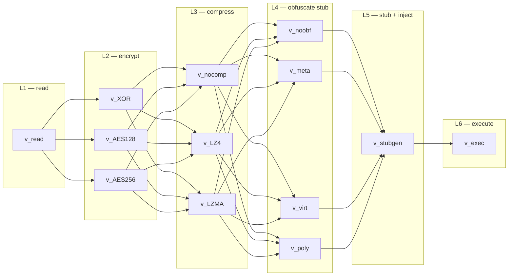

# Crypter Graph Model

**Bachelor's thesis** (Kazan Federal University, Institute of Computational
Mathematics and Information Technologies, 2026): *graph models for analyzing the
effectiveness of crypters*.

A layered directed acyclic graph (DAG) model that formalizes, analyzes and
optimizes the architecture of binary **PE crypters** for Windows x64 — the tools
that encrypt, compress and obfuscate an executable payload to reduce its
detectability and raise its cryptostrength.

## What it does

The project treats a crypter as a 6-layer pipeline (read → encrypt → compress →
obfuscate stub → generate/inject stub → run) and models it as a weighted DAG:

| Layer | Role | Nodes |
|-------|------|-------|
| L1 | Read PE file | `v_read` |
| L2 | Encryption | `v_XOR`, `v_AES128`, `v_AES256` |
| L3 | Compression | `v_nocomp`, `v_LZ4`, `v_LZMA` |
| L4 | Stub obfuscation | `v_noobf`, `v_meta`, `v_virt`, `v_poly` |
| L5 | Stub generation + injection | `v_stubgen` |
| L6 | Execute result | `v_exec` |

Each node carries measurable characteristics `C(v) = {t, s, e, d}`:

- `t` — execution time (ms, averaged over 100 runs)
- `s` — cryptostrength [0.0–1.0]
- `e` — output entropy (bits/byte, Shannon over 0–255)
- `d` — detectability [0.0–1.0] (VirusTotal detected/total)

Path aggregates over `P = (v1..v6)`: `T(P) = Σt`, `S(P) = max s`, `E(P) = mean e`,
`D(P) = 1 − Π(1−d)`. Edge weights capture transition overhead (e.g. AES→LZMA is
costly since encrypted data compresses poorly).



## Repository layout

```
crypters/   C++17 experimental crypters (Windows x64 PE)
  common/     PE reader, profiler (QueryPerformanceCounter), Shannon entropy
  encryption/ XOR, AES-128-CBC, AES-256-CBC (Windows CNG)
  compression/ none, LZ4, LZMA
  obfuscation/ none, metamorphic, virtualization, polymorphic
  stub/        stub generation + injection (resource section)
  variants/    assembled crypter A/B/C/D

app/        Python application (PyQt5 GUI)
  graph/     DAG model, Dijkstra-based optimizer, NetworkX visualizer
  db/        SQLite reference database (120 configurations), repository, seed
  builder/   modular assembler
  ui/        PyQt5 widgets (config form, graph widget, results panel)
  experiments/ scenario runner (12 scenarios)
```

### Crypter variants (measured)

| Variant | Encryption | Compression | Stub obfuscation | t (ms) | s | d |
|---------|-----------|-------------|------------------|--------|---|---|
| A | XOR fixed key | none | none | 12 | 0.3 | 0.60 |
| B | AES-128 CBC | LZ4 | none | 47 | 0.75 | 0.40 |
| C | AES-256 CBC | LZMA | virtualization | 180 | 1.0 | 0.12 |
| D | AES-256 CBC | none | metamorphic | 89 | 0.8 | 0.35 |

## Stack

- **C++17**, CMake 3.20+, Windows CNG (or OpenSSL 3.x), lz4, liblzma
- **Python 3.11+**, PyQt5, NetworkX, Matplotlib, SQLite

## Run

Crypter build (Windows x64, MSVC/MinGW):

```bash
cd crypters
cmake -B build -DCMAKE_BUILD_TYPE=Release -A x64
cmake --build build --config Release
build/Release/crypter_a.exe <payload.exe> <output.exe>
```

Python application:

```bash
cd app
pip install -r requirements.txt
python main.py
```

## Tests

```bash
cd app
pytest tests/
```

## Notes

- Research/educational project: reproducible and documented, but not
  production-ready.
- Detectability is measured manually via VirusTotal; entropy via Bintropy or the
  bundled `common/entropy.hpp`.
- The model is calibrated on 120 configurations (36 unique paths × payload sizes
  4/64/256/512 KB) with 4 experimentally validated baselines (A/B/C/D).

See `CLAUDE.md` for the full architecture, conventions and model-quality targets.
